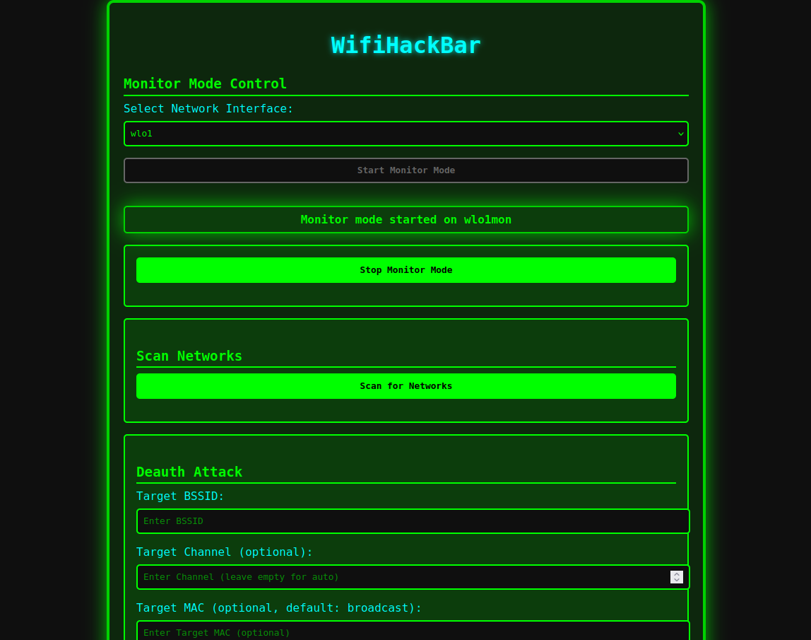

# WifiHackBar - Wifi Hacking Tool

**WIfihackbar** is a powerful Python-Flask-based WiFi hacking toolkit with a user-friendly web interface. Designed for cybersecurity professionals, ethical hackers, and penetration testers,
this tool provides an all-in-one solution for WiFi network auditing and exploitation
From scanning nearby networks to executing deauthentication attacks, WIfihackbar brings advanced wireless testing capabilities to your browser

## 🌐 Features

- 🚀 **Automatic Monitor Mode Switching**  
  Seamlessly switch your wireless adapter into monitor mode without manual commands.

- 📡 **WiFi Network Scanning**  
  Discover all nearby WiFi networks in real time through the browser interface.

- 🔥 **Deauthentication Attack**  
  Disconnect selected clients from targeted WiFi networks using powerful deauth attacks.

- 🎭 **Fake Access Point Generation**  
  Create multiple fake WiFi networks to trap and analyze client devices.

- 🖥️ **Web-Based Interface**  
  Fully web-accessible dashboard for ease of use — no terminal commands required for operation.



---

## 🧪 Installation & Setup

1. **Download the necessary dependencies**  
```
   bash downloads.sh
```

2. **Install Flask framework**

   ```
   pip3 install flask
   ```

---

## 🚀 Usage

Run the tool with root privileges:

```bash
sudo python3 main.py
```

Then open your browser and navigate to:

```
http://127.0.0.1:5000
```

---

## ⚠️ Disclaimer

This tool is intended **strictly for educational and ethical penetration testing purposes only**. Unauthorized use against networks you do not own or have explicit permission to test is **illegal and unethical**. The developer is not responsible for any misuse or damages caused by this software.

---

## 👨‍💻 Author

**SilverXCyber**
Cybersecurity Researcher | Ethical Hacker

🔗 [YouTube](https://youtube.com/@silverxcyber)

📷 [Instagram](https://instagram.com/silverxcyb4r)

📢 [Telegram](https://t.me/silverxvip)

✍️ [Medium Blog](https://medium.com/@silverxcyber)

> ⭐ If you find this project useful, consider subscribing to the YouTube channel and following on social platforms for more tools and tutorials!
